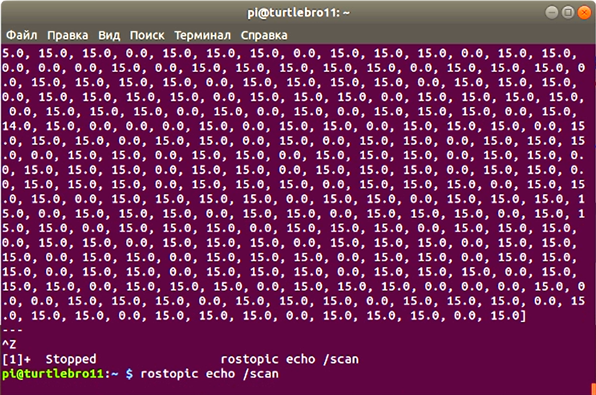

# Автоматизация сбора данных средствами ROS
## Анатация

## Ключевые слова
ROS, программирование, Лидар, Slam map, одометрия

В данной статье рассмотрен автоматический сбор данный с использованием системы ROS, а также различных ее модулей и прилогающихся плагинов. Сбор данных осуществляется с помощью лидара, датчика температуры и комплексной системы датчиков одометрии. 

## Введение

Для автоматизации сбора данных о температуре в прозводственном помещении наболее эффективным по ресурсам становятся роботы, оснащённые лидарами и тепловыми камерами. Ввиду сложности робота, наиболее оптимальным решение будет выбрать "ROS".

ROS - это фрэймворк, предоставляющий большой набор инструментов, правил и библиотек, позволяющих упростить разработку роботов и распределить выполнение программных функций между различными платформами, цельную структуру фрэймворка можно увидеть на рис 1.

Проект с открытым исходным кодом такого уровня как ROS имеет большое комюнити, вследствии чего появляется множество библиотек для различных модулей и платформ, позволяющих оперативно подключать новые сервисы и функции в проект, без изобретения "велосипедов".

Все программы на ROS состоят из маленьких единц - node (нода), каждая нода исполняет отдельную конкретную задачу.

Для организации нод требует общее пространство имён, которое обеспечи мастер - исполняющий сервер.

При решении нашей задачи будут использованны модели топиков. Топик обеспечивает более рациональньную передачу информации между нодами, в такой модели ноды разделяются на издателей и подписчиков.

###### рисунок 1 - архитектура ROS

## Получение данных из топика

Для создания обработчика публикации мы будем использовать библиотеку rospy.Publisher Code API, эта библиотека позволяет создавать топики. 

Чтобы отобразить данные из топика требуется использовать утилиту rostopic, специально предназначенно для отображения информации об отладке из "издателей" в ROS, с помощью этой утилиты легко можно найти нужный топик и вывести метаинформации из него. Примером использования этой утилиты рис 2.

###### рисунок 2 - Вывод метаметаинформации

## Рендеринг средствами rviz

Один из инструментов ROS - это пакет визуализации RVIZ, позволяющий осуществлять трёхмерный рендер данных со сканеров и тепературных сенсоров.

Для получения расстоянии от робота в реальном времени был использован лидар, рэндер трёхномерной карты становится возможным благодаря одометри снимающейся с энкодеров колёс робота, чтобы увеличить точность данных одометрии и повысить качество рэндера был использлован датчик IMU.

После того как робот обошёл периметр помешщения была получена трёхмерная карта, обозначающая допустимые для движения и сбора данных места, рис 3

###### рисунок 3 трёхмерная карта помещения

## Автономное движение по точкам

С помощью полученной карты, мы можем определить координаты точек, через которые будет просиходить патрулирование территории. Координаты данных точек в порядке следования друг от друга, необходимо записать в файл "patrol", находящийся в пакете патрулирования. После записи точек патрулирования, необходимо пересобрать данный пакет, для применения изменений. Для запуска патрулирования мы будем использовать функцию "launch". Пример получения метаданных из данной функции отображено на рисунке 4. 

###### Рисунок 4 - Метаданые функции "Launch"

## ссылки

[manual](http://docs.voltbro.ru/starting-ros/)

Введение в ROS [Электронный ресурс]. – Режим доступа: URL: http://docs.voltbro.ru/starting-ros/ (04.10.2020)

[manual](https://manual.turtlebro.ru/)

Инструкция робота TurtleBro [Электронный ресурс]. – Режим доступа: URL: https://manual.turtlebro.ru/ (04.10.2020)

[melodic](http://wiki.ros.org/melodic/Installation/Ubuntu)
http://wiki.ros.org/melodic/Installation/Ubuntu

Ubuntu install of ROS Melodic [Электронный ресурс]. – Режим доступа: URL: http://wiki.ros.org/melodic/Installation/Ubuntu

[navigations](https://github.com/voltbro/turtlebro_navigation)
https://github.com/voltbro/turtlebro_navigation

Turtlebro navigation stack [Электронный ресурс]. – Режим доступа: URL: https://github.com/voltbro/turtlebro_navigation

[slam](https://github.com/voltbro/turtlebro_slam)
https://github.com/voltbro/turtlebro_slam

Turtlebro slam navigation  [Электронный ресурс]. – Режим доступа: URL: https://github.com/voltbro/turtlebro_slam

